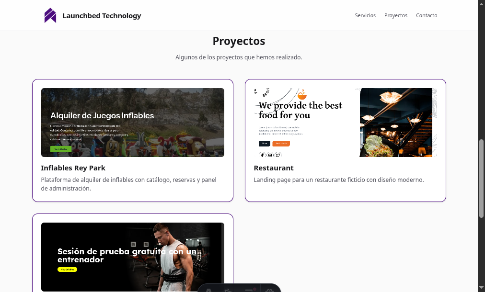
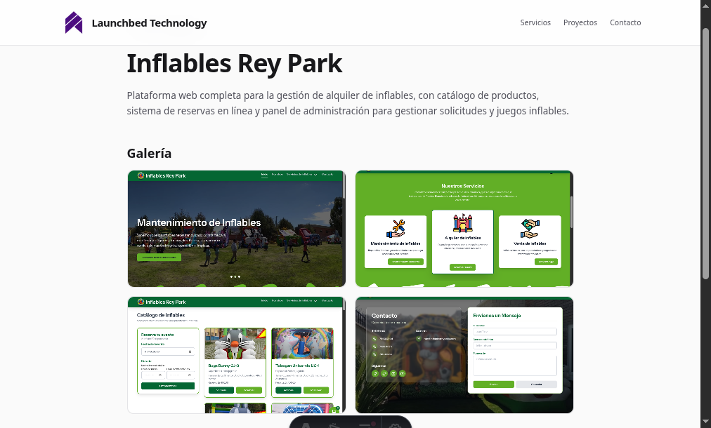

# Launchbed Technology

Portfolio website for **Launchbed Technology**, a digital agency specializing in landing pages and custom websites.

Built with [Astro 7](https://docs.astro.build) and [Tailwind CSS v4](https://tailwindcss.com).

## Images





## Commands

| Command        | Action                               |
| :------------- | :----------------------------------- |
| `pnpm dev`     | Start dev server at `localhost:4321` |
| `pnpm build`   | Build for production to `./dist/`    |
| `pnpm preview` | Preview production build locally     |

## Project Structure

```
src/
├── content.config.ts       # Content collection config
├── content/projects/       # Project markdown files
├── pages/
│   ├── index.astro         # Landing page
│   └── proyectos/[slug].astro  # Project detail pages
├── components/
│   └── ProjectCard.astro   # Project card component
├── layouts/
│   └── Layout.astro        # Base layout
└── styles/
    └── global.css          # Tailwind + custom theme
```

## Adding Images

Images are stored in `public/images/projects/<project-slug>/`.

Each project expects:

- `cover.jpg` — displayed on the project card (landing page)
- `slide1.jpg`, `slide2.jpg`, etc. — gallery on the project detail page

## Adding a Project

Create a `.md` file in `src/content/projects/` with the following frontmatter:

```yaml
---
title: "Project Name"
shortDesc: "Short summary for the card"
description: "Full description for the detail page"
cover: "/images/projects/my-project/cover.jpg"
link: "https://example.com" # optional
images: ["slide1.jpg", "slide2.jpg"] # optional
---
Body content for the "Sobre el proyecto" section.
```

## Tech Stack

- **Astro 7** — static site generation
- **Tailwind CSS v4** — styling (`@tailwindcss/vite`)
- **Sharp** — image optimization
- **Content collections** — markdown data via `glob()` loader
